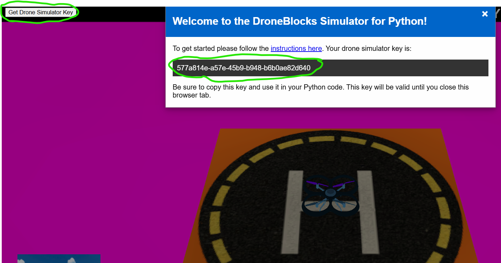

# TELLO SIMULATED TASKS


### CREATING VIRTUAL ENVIRONMENT

```bash
# Command 1
python -m venv sim_env
# Command 2
.\sim_env\scripts\activate
# Command 3
python -m pip install -r sim_requirements.txt
```
### LINK TO DRONE BLOCK SIMULATOR
[DroneBlocks MQTT Simulator](https://coding-sim.droneblocks.io/)


### GET SIMULATOR KEY
